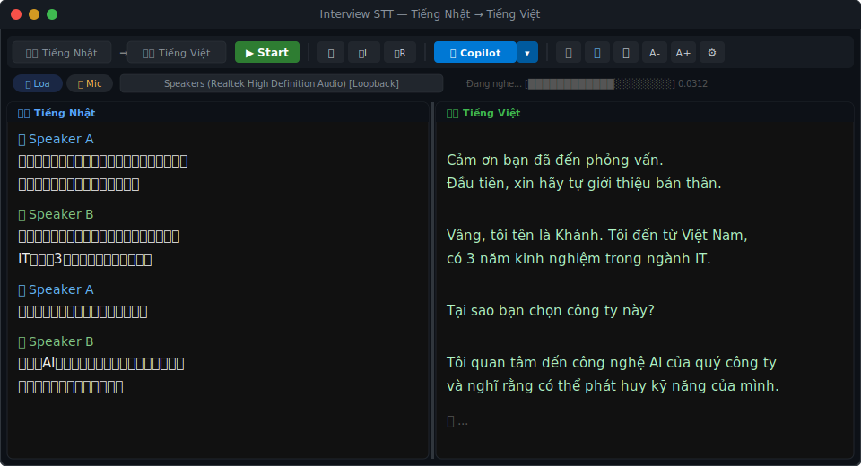
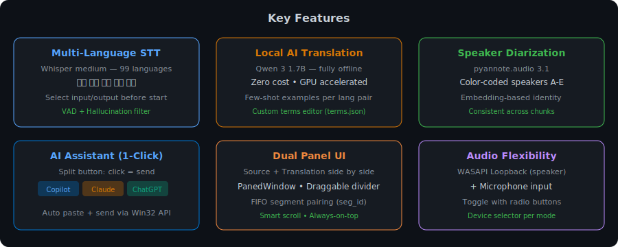
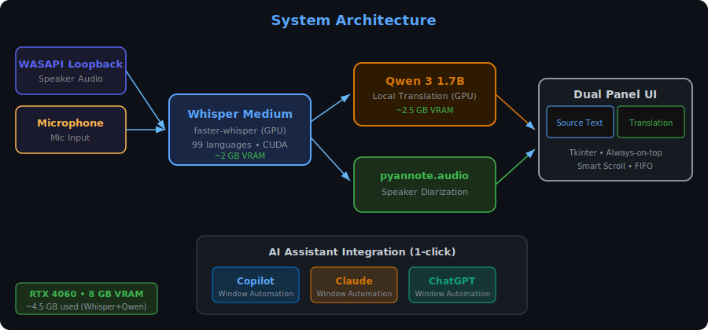
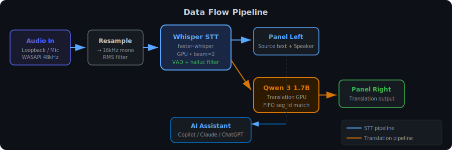

# 🎙 Interview STT — Real-time Speech-to-Text & Translation

> **Version:** `v20260622` — [Changelog](CHANGELOG.md) | [Previous version (v1.0)](../../tree/v1.0)

**Fully local, GPU-accelerated** real-time speech-to-text, translation, and AI analysis app designed for online interviews (Teams, Zoom, Google Meet). Captures speaker audio via WASAPI loopback or microphone, transcribes with Whisper or ReazonSpeech, translates with Qwen 3, and provides AI-powered content analysis — all running locally. Zero cloud cost.



---

## ✨ Features



### Core
- **Dual STT engine** — Whisper medium (99 languages, GPU) or ReazonSpeech k2-asr (Japanese-specialized, CPU)
- **Adjustable chunk size** — 1s / 2s / 4s / 6s / 8s / 10s transcription interval for speed vs accuracy
- **Local AI translation** — Qwen 3 1.7B runs entirely on GPU. Zero API cost, fully offline
- **AI Analysis** — Qwen-powered panel with 4 modes: Summary, Keywords, Issues, Answer Suggestions
- **Speaker diarization** — pyannote.audio identifies and color-codes up to 5 speakers across chunks
- **3-panel UI** — Source (STT) | Translation | AI Analysis with toggleable panels
- **FIFO segment pairing** — Each source segment gets a `seg_id`, translation replaces the `⏳` placeholder when ready

### Audio
- **WASAPI Loopback** — Capture system/speaker audio (hear what the interviewer says)
- **Microphone input** — Capture your own voice (practice mode)
- **Device selector** — Choose specific audio device per mode

### AI Assistant Integration
- **1-click AI query** — Split button: click sends, dropdown selects AI
- **3 AI options** — Microsoft Copilot, Claude Desktop, ChatGPT
- **Window automation** — Auto-find window → focus → click input → paste → send (Win32 API)

### TTS (Text-to-Speech)
- **Edge TTS** — Microsoft Neural Voices for reading translations aloud
- **TTS feedback prevention** — Auto-pauses transcription during TTS playback to avoid loopback

### Quality
- **VAD filter** — Voice Activity Detection skips silence
- **Hallucination filter** — Per-language blacklist removes common Whisper artifacts
- **RMS threshold** — Ignores audio below volume threshold
- **Custom terms** — Edit interview vocabulary (JP↔VI) via built-in editor, hot-reload into Qwen prompt

---

## 🏗 Architecture



---

## 🔄 Data Flow



---

## 📋 Requirements

| Component | Spec |
|---|---|
| **OS** | Windows 10/11 |
| **GPU** | NVIDIA with ≥6 GB VRAM (RTX 3060+ recommended) |
| **CUDA** | 12.x with cuDNN 9 |
| **Python** | 3.10+ |
| **RAM** | 8 GB+ |

### VRAM / Resource Usage
| Model | VRAM | Device |
|---|---|---|
| Whisper medium | ~2 GB | GPU |
| Qwen 3 1.7B | ~2.5 GB | GPU |
| ReazonSpeech k2 | ~159 MB | CPU |
| **Total (Whisper)** | **~4.5 GB** | |
| **Total (ReazonSpeech)** | **~2.5 GB** | |

---

## 🚀 Installation

### 1. Clone

```bash
git clone https://github.com/KhanhNguyenAI/translate-For-E-learning-using-AI-LOCAL.git
cd translate-For-E-learning-using-AI-LOCAL
```

### 2. Install PyTorch with CUDA

```bash
pip install torch torchvision torchaudio --index-url https://download.pytorch.org/whl/cu128
```

### 3. Install dependencies

```bash
pip install -r requirements.txt
```

### 4. Configure

Copy the example config and add your tokens:

```bash
cp config.example.json config.json
```

Edit `config.json`:

```json
{
  "hf_token": "hf_YOUR_HUGGINGFACE_TOKEN",
  "gemini_api_key": "YOUR_GEMINI_API_KEY",
  "qwen_model": "Qwen/Qwen3-1.7B"
}
```

| Key | Required | Purpose |
|---|---|---|
| `hf_token` | For diarization | HuggingFace token for pyannote.audio |
| `gemini_api_key` | Optional | For Gemini Live Translate (geminit.py) |
| `qwen_model` | Optional | Override Qwen model name (default: Qwen/Qwen3-1.7B) |

### 5. Run

```bash
python -X utf8 main.py
```

> **Note:** `-X utf8` is required on Windows to avoid UnicodeEncodeError with Vietnamese output.

---

## 🎮 Usage

### Basic Workflow

1. **Select languages** — Choose input language (e.g. 🇯🇵 Japanese) and output language (e.g. 🇻🇳 Vietnamese)
2. **Select STT engine** — Whisper (multi-language, GPU) or ReazonSpeech (Japanese, CPU)
3. **Select chunk size** — 1s (fastest) to 10s (most context) transcription interval
4. **Select audio source** — `🔊 Loa` (speaker/loopback) for interviews, `🎙 Mic` for practice
5. **Click ▶ Start** — STT engine loads first, then Qwen loads (VRAM ordering)
6. **Toggle features** — 🌐 Translation, 🔊 TTS, 🧠 AI Analysis, 👥 Diarization (all OFF by default)
7. **Watch real-time transcription** — Left panel shows source text
8. **Use AI Analysis** — Click 📝/🔑/⚠️/💡 buttons to analyze transcribed content
9. **Ask AI** — Click the AI button to send transcribed text to Copilot/Claude/ChatGPT

### Supported Languages

| Language | Code | Flag |
|---|---|---|
| Japanese | `ja` | 🇯🇵 |
| English | `en` | 🇬🇧 |
| Chinese | `zh` | 🇨🇳 |
| Myanmar | `my` | 🇲🇲 |
| Vietnamese | `vi` | 🇻🇳 |

Whisper supports 99 languages total — add more in `SUPPORTED_LANGS` dict.

### Keyboard Shortcuts

| Shortcut | Action |
|---|---|
| `Ctrl+Enter` | Send to selected AI (Copilot) |
| `Ctrl+Shift+Enter` | Send to Claude |
| `Ctrl+Shift+C` | Copy source text |
| `Ctrl+Shift+V` | Copy translation |
| `Ctrl+Delete` | Clear all text |
| `Ctrl+D` | Toggle dual/single panel |
| `Ctrl+T` | Toggle translation on/off |
| `Ctrl+G` | Open terms editor |

### Custom Terms

Click `⚙` to open the terms editor. Format: one term per line, `Japanese = Vietnamese`:

```
面接 = phỏng vấn
志望動機 = động cơ ứng tuyển
自己紹介 = tự giới thiệu
```

Terms are saved to `terms.json` and hot-reloaded into the Qwen translation prompt.

---

## 📁 Project Structure

```
├── main.py                  # Entry point
├── app.py                   # Main tkinter UI + orchestration
├── config.py                # Settings, constants, model config
├── requirements.txt         # Python dependencies
├── CHANGELOG.md             # Version history
├── audio/
│   ├── loopback.py          # WASAPI loopback capture
│   └── mic.py               # Microphone capture
├── stt/
│   ├── transcriber.py       # Whisper STT engine
│   ├── sensevoice.py        # ReazonSpeech STT engine
│   └── diarization.py       # Speaker diarization (pyannote)
├── translation/
│   ├── qwen.py              # Qwen 3 translator thread
│   ├── analysis.py          # AI Analysis (summary/keywords/issues/answers)
│   └── terms.py             # Custom terminology management
├── tts/
│   └── engine.py            # Edge TTS + feedback prevention
├── ai/
│   └── automation.py        # Copilot/Claude/ChatGPT window automation
└── docs/
    ├── architecture.svg
    ├── flow.svg
    ├── ui-mockup.svg
    └── features.svg
```

---

## 🔧 Environment Variables

| Variable | Default | Description |
|---|---|---|
| `STT_MODEL` | `medium` | Whisper model size (tiny/base/small/medium/large) |
| `STT_DEVICE` | `cuda` | Device for Whisper (cuda/cpu) |
| `STT_COMPUTE` | `int8_float16` | Compute type for CTranslate2 |

Example:

```bash
set STT_MODEL=large
python -X utf8 main.py
```

---

## 🛠 Troubleshooting

| Problem | Solution |
|---|---|
| `torch` is CPU-only | Reinstall: `pip install torch --index-url https://download.pytorch.org/whl/cu128` |
| Whisper model is None | VRAM issue — Qwen waits for Whisper via `model_ready` Event |
| UnicodeEncodeError | Run with `python -X utf8 main.py` |
| No loopback devices | Install [PyAudioWPatch](https://pypi.org/project/PyAudioWPatch/) and check WASAPI |
| Qwen returns Japanese | Few-shot examples + `enable_thinking=False` should fix this |
| NVIDIA DLL not found | The app auto-discovers DLL paths via `importlib.util.find_spec` |

---

## 📄 License

MIT License — free for personal and commercial use.

---

## 🙏 Credits

- [faster-whisper](https://github.com/SYSTRAN/faster-whisper) — CTranslate2 Whisper implementation
- [Qwen 3](https://huggingface.co/Qwen/Qwen3-1.7B) — Alibaba's multilingual LLM
- [pyannote.audio](https://github.com/pyannote/pyannote-audio) — Speaker diarization
- [PyAudioWPatch](https://github.com/s0d3s/PyAudioWPatch) — WASAPI loopback support
- [ReazonSpeech](https://research.reazon.jp/projects/ReazonSpeech/) — Japanese-specialized STT
- [Edge TTS](https://github.com/rany2/edge-tts) — Microsoft Neural Voices

---

**Made with ❤️ for the Vietnamese community studying and working in Japan**
